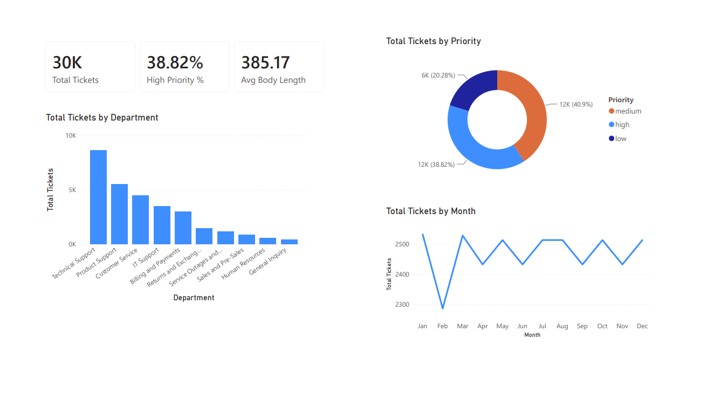
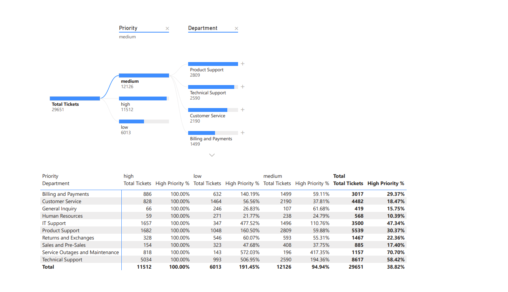
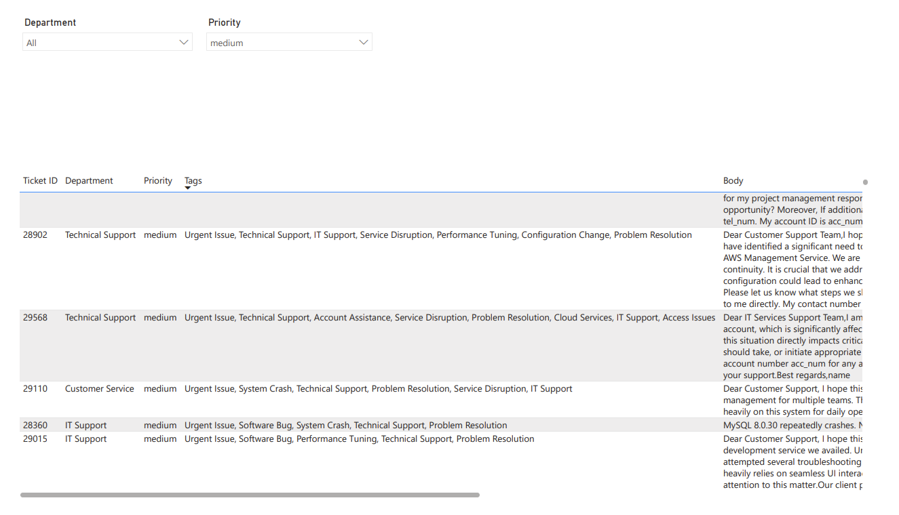

# Enterprise IT Support & Ticket Analytics Dashboard

## Executive Summary
An end-to-end Power BI analytics solution engineered to monitor IT service desk performance, detect operational bottlenecks, and analyze customer incident text across 29,651 ticket records and 10 departments.

## Data Architecture & Modeling
* **Star Schema Architecture:** Connected a fact table (`IT Support Ticket Data`) with a DAX-generated calendar table (`Dim_Date`) using a 1-to-Many relationship.
* **ETL & Data Engineering:** Parsed stringified array fields, generated character length diagnostics, and engineered synthetic time attributes using Power Query M.

## Key DAX Measures
* **Total Volume:** `Total Tickets = COUNT('IT Support Ticket Data'[Ticket ID])`
* **High-Priority Escalation Rate:** `High Priority % = DIVIDE([High Priority Tickets], [Total Tickets], 0)`
* **Incident Complexity Proxy:** `Avg Body Length = AVERAGE('IT Support Ticket Data'[Body Character Count])`

## Dashboard Features
1. **Executive Incident Overview:** High-level KPI cards, monthly ticket trend analysis, and volume distribution by priority.
2. **Category & Root-Cause Analysis:** Interactive Decomposition Tree visual breaking down ticket drivers by Department, Priority, and Tags.
3. **Operational Deep-Dive:** Searchable detail view with word-wrapped description text and multi-attribute dropdown slicers.

## Dashboard Screenshots

